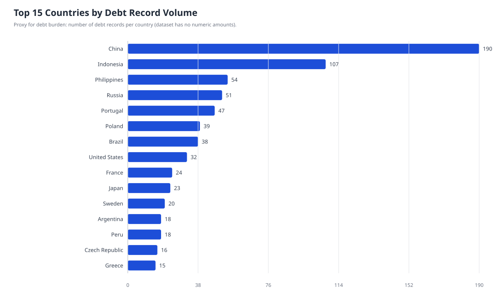
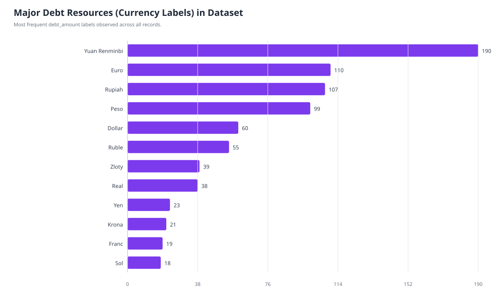
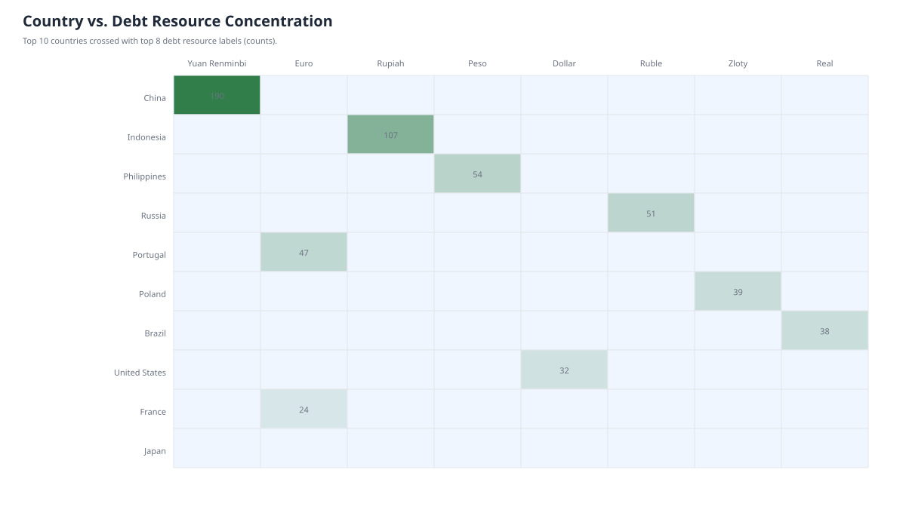
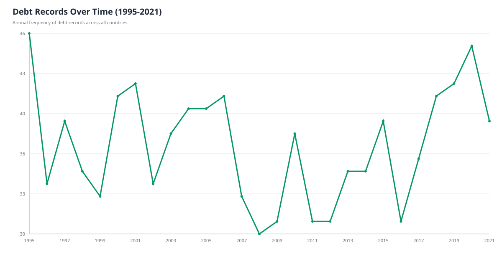

# World Debt Dataset — Exploratory Data Analysis (EDA)

## 1) Objective
This report performs a comprehensive exploratory data analysis on the repository's world debt dataset (`debtdata.csv`) and provides:

- Countries with the largest debt burdens
- Grouping/ranking of countries by debt size
- Major debt sources/resources
- Cross-country comparisons
- Notable patterns, trends, anomalies, and practical actions

---

## 2) Dataset overview

- **File analyzed:** `debtdata.csv`
- **Rows:** 1,000
- **Columns:** 6
  - `country`
  - `year`
  - `debt_amount`
  - `debt_type`
  - `debt_reason`
  - `debt_status`

### Important data caveat
The `debt_amount` column contains **currency labels** (for example, `Yuan Renminbi`, `Euro`, `Dollar`) instead of numeric debt values. Because of this, this analysis uses **record frequency per country** as a proxy for debt burden in this dataset.

---

## 3) Approach and reproducibility

All analysis artifacts were generated with:

```bash
python eda_report.py
```

This script:
- Loads and profiles data
- Computes country rankings and groupings
- Builds trend and cross-tab comparisons
- Exports charts to `analysis/*.svg`
- Writes summary metrics to `analysis/summary_stats.txt`

---

## 4) Key findings

## A. Countries with the largest debt burdens (frequency proxy)

Top countries by number of debt records:

1. China — 190
2. Indonesia — 107
3. Philippines — 54
4. Russia — 51
5. Portugal — 47
6. Poland — 39
7. Brazil — 38
8. United States — 32
9. France — 24
10. Japan — 23



**Interpretation:** The distribution is highly concentrated: China and Indonesia together account for a large share of all records, indicating potential portfolio concentration risk.

---

## B. Grouping/ranking countries by debt size

Countries were segmented by quartiles of record counts (proxy burden tiers):

- **Low burden:** 39 countries
- **Moderate burden:** 28 countries
- **High burden:** 24 countries
- **Very High burden:** 26 countries

**Interpretation:** The dataset is not uniformly distributed; many countries sit in the low tier while a smaller set carries significantly heavier representation.

---

## C. Major debt sources/resources

In this dataset, the nearest available proxy to debt source/resource is the `debt_amount` label (currency bucket):

- Yuan Renminbi — 190
- Euro — 110
- Rupiah — 107
- Peso — 99
- Dollar — 60
- Ruble — 55
- Zloty — 39
- Real — 38



Additional composition indicators:
- **Debt type:** Corporate (348), Government (335), Personal (317)
- **Debt reason:** Infrastructure (348), Healthcare (333), Education (319)
- **Debt status:** Overdue (351), Current (338), Paid off (311)

**Interpretation:** Debt classes are fairly balanced, but overdue records are slightly dominant and deserve monitoring.

---

## D. Comparisons across countries/resources

The heatmap below compares top countries against top debt resource labels.



**Notable pattern:** Each country maps strongly to one currency label (one-to-one behavior across records), suggesting the dataset is structured around domestic-currency assignments rather than multi-currency debt portfolios.

---

## E. Trends over time and anomalies

Annual debt-record activity (1995–2021):



- Highest activity years include **1995 (46)** and **2020 (45)**.
- Lowest observed annual volume is around **30–31** records.
- Time series is relatively stable with mild oscillations, not extreme spikes.

### Anomalies / data-quality flags
1. **No numeric debt amounts:** limits true burden/ratio analyses.
2. **Country-currency one-to-one structure:** may indicate synthetic or highly normalized data.
3. **Balanced categorical fields:** suspiciously even splits can reflect generated distributions.

---

## 5) Actionable insights

1. **Prioritize concentration monitoring** for China and Indonesia exposures (frequency-weighted share is highest).
2. **Set overdue-control policies** by debt type and reason, since overdue is the largest status class.
3. **Upgrade schema immediately** by adding numeric fields:
   - debt principal
   - interest rate
   - maturity date
   - debt-to-GDP ratio
   - creditor class
4. **Enable regional analytics** with explicit region/continent columns to support true geo-risk comparison.
5. **Add time continuity checks** (per-country per-year completeness) before forecasting.

---

## 6) Recommended next-step analysis (once numeric debt values are available)

- Debt burden per capita and debt-to-GDP benchmarking
- Overdue probability modeling by debt type/reason/country
- Country risk clustering and outlier detection
- Trend decomposition and stress-scenario simulation

---

## 7) Files produced

- `debtdata.csv` — source dataset
- `eda_report.py` — analysis pipeline script
- `analysis/top_countries_debt_burden.svg`
- `analysis/major_debt_resources.svg`
- `analysis/country_resource_heatmap.svg`
- `analysis/yearly_debt_records_trend.svg`
- `analysis/summary_stats.txt`

